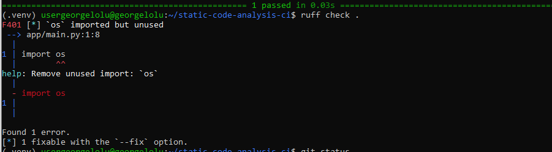
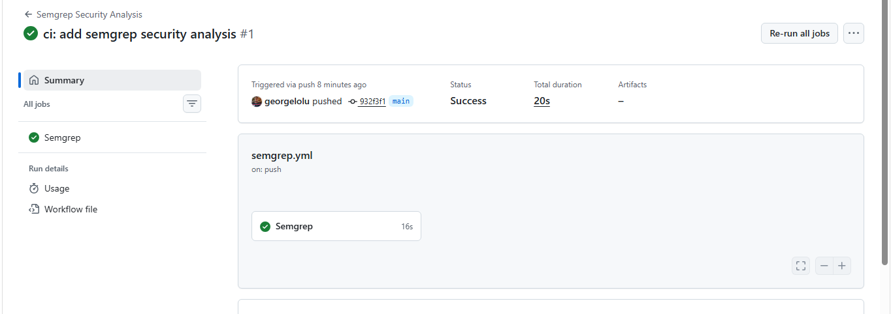
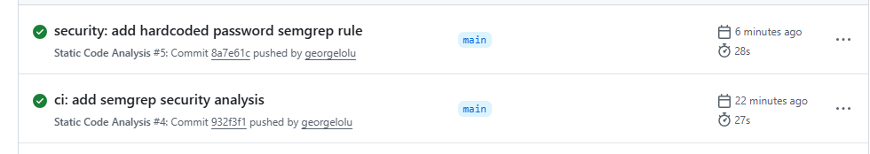
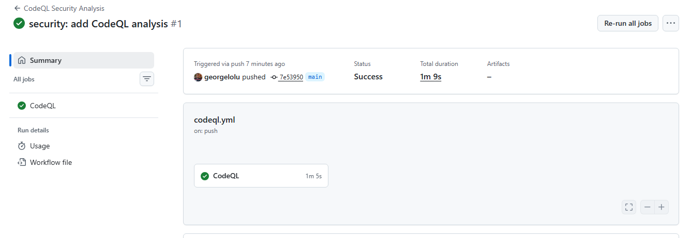
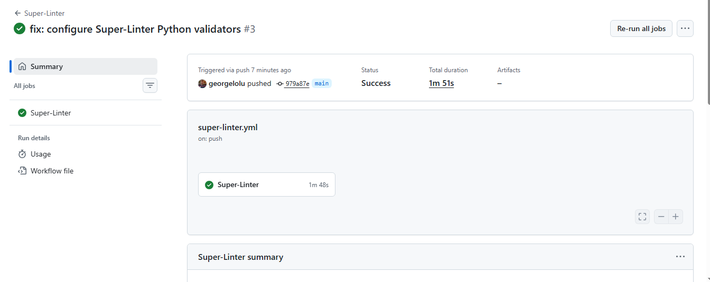

# Static Code Analysis CI/CD

A practical DevSecOps project demonstrating how static code analysis and security scanning can be integrated into a GitHub Actions CI/CD pipeline.

The project evaluates and implements multiple static-analysis approaches for Python applications, including **Ruff, Semgrep, CodeQL, Black, Pylint, and Super-Linter**.

It also demonstrates intentional code-quality and security findings, CI detection, remediation workflow, and successful automated validation.

---

## 📌 Project Overview

Static code analysis examines source code without executing the application.

In a CI/CD environment, static analysis can automatically identify:

* Code-quality problems
* Formatting issues
* Maintainability problems
* Security-sensitive coding patterns
* Potential programming errors
* Type-checking problems
* Configuration issues

This project demonstrates how these checks can be integrated into GitHub Actions so that problems are detected automatically during the software development lifecycle.

---

## 🎯 Project Objectives

The main objectives are to:

1. Research static code analysis tools suitable for CI/CD.
2. Compare tools based on capabilities and language support.
3. Integrate multiple analysis tools into GitHub Actions.
4. Demonstrate intentional code-quality failures.
5. Demonstrate security findings using Semgrep.
6. Demonstrate deeper security analysis using CodeQL.
7. Demonstrate multi-linter validation using Super-Linter.
8. Document the CI/CD workflow and results.
9. Provide evidence of failed findings and successful CI checks.

---

# 🏗️ Architecture

```text
                         GitHub Repository
                                │
                                ▼
                       Push / Pull Request
                                │
                                ▼
                         GitHub Actions
                                │
              ┌─────────────────┼──────────────────┐
              │                 │                  │
              ▼                 ▼                  ▼
           pytest              Ruff             Semgrep
        Functional Tests   Python Linting       Security
              │                 │                  │
              └─────────────────┼──────────────────┘
                                │
                                ▼
                             CodeQL
                       Semantic Security
                           Analysis
                                │
                                ▼
                         Super-Linter
                    Multi-Linter Validation
                                │
                                ▼
                     Quality / Security Checks
                                │
                         ┌──────┴──────┐
                         │             │
                         ▼             ▼
                       FAIL          PASS
                         │             │
                     Fix Code        Continue
                                       │
                                       ▼
                                     Merge
```

---

# 🛠️ Tools Evaluated

| Tool             | Primary Purpose                 | Language Focus | Security              | CI/CD Integration     |
| ---------------- | ------------------------------- | -------------- | --------------------- | --------------------- |
| **Ruff**         | Linting and code quality        | Python         | Limited               | Excellent             |
| **Semgrep**      | Pattern-based security analysis | Multi-language | Strong                | Excellent             |
| **CodeQL**       | Semantic security analysis      | Multi-language | Strong                | Excellent with GitHub |
| **Black**        | Code formatting                 | Python         | No                    | Excellent             |
| **Pylint**       | Code-quality analysis           | Python         | Limited               | Excellent             |
| **Super-Linter** | Multi-linter orchestration      | Multi-language | Depends on validators | Excellent             |

The tools serve different purposes and are therefore complementary rather than interchangeable.

---

# 🔍 Tool Details

## Ruff

Ruff is a fast Python linter and code-quality tool.

It was used to identify problems such as:

* Unused imports
* Python linting violations
* Code-quality issues

Example:

```bash
ruff check .
```

Successful result:

```text
All checks passed!
```

---

## Semgrep

Semgrep was used as the security-focused static analysis layer.

A custom rule was created to demonstrate detection of a hardcoded password:

```yaml
rules:
  - id: hardcoded-password
    languages:
      - python
    message: "Hard-coded password detected. Use environment variables or a secret manager."
    severity: ERROR
    patterns:
      - pattern: |
          return "SuperSecretPassword123"
```

The rule demonstrates how security-sensitive coding patterns can be detected automatically during CI.

Local scan:

```bash
semgrep scan --config=.semgrep/security.yml app/
```

The project intentionally contains the hardcoded password pattern as a controlled security demonstration.

This allows the repository to demonstrate the complete security-analysis workflow:

```text
Intentional Security Issue
          ↓
       Semgrep
          ↓
   Security Finding
          ↓
      Remediation
          ↓
   Security Verification
```

The hardcoded password is **demonstration code only** and should not be used in a production application.

In a production implementation, credentials should be supplied through environment variables, GitHub Actions secrets, a cloud secret manager, or another appropriate secrets-management solution.

---

## CodeQL

CodeQL provides deeper semantic analysis of source code.

It was integrated into GitHub Actions using the CodeQL Action for Python.

The workflow performs:

1. Repository checkout
2. CodeQL initialization
3. Python analysis
4. Security-result analysis

CodeQL provides a different analysis approach from pattern-based tools such as Semgrep.

---

## Black

Black provides automated Python code formatting.

It was included through Super-Linter to ensure that Python source code follows consistent formatting rules.

Local validation:

```bash
black --check app/ tests/
```

Successful result:

```text
All done! ✨ 🍰 ✨
4 files would be left unchanged.
```

---

## Pylint

Pylint performs deeper Python code-quality analysis.

It checks areas such as:

* Documentation
* Naming conventions
* Code structure
* Potential programming errors
* Maintainability

The project initially required code-quality improvements to satisfy Pylint.

After remediation:

```text
Your code has been rated at 10.00/10
```

---

## Super-Linter

Super-Linter was added as a multi-linter CI layer.

It validates the Python project using multiple tools, including:

* Ruff
* Black
* Flake8
* isort
* mypy
* Pylint

The workflow was kept separate from the Ruff, Semgrep, and CodeQL workflows so that each analysis layer could be demonstrated independently.

---

# 🚀 CI/CD Workflows

The project contains separate GitHub Actions workflows:

```text
.github/
└── workflows/
    ├── static-analysis.yml
    ├── semgrep.yml
    ├── codeql.yml
    └── super-linter.yml
```

### Static Analysis

Runs:

* pytest
* Ruff

### Semgrep

Runs security-focused pattern analysis.

### CodeQL

Runs semantic security analysis.

### Super-Linter

Runs multiple Python linters and formatters.

---

# 🧪 Testing

The project includes a basic unit test for the discount calculation.

Run locally:

```bash
python -m pytest -v
```

Expected result:

```text
1 passed
```

---

# 🔐 Security Demonstration

A major objective of this project was to demonstrate the security-analysis feedback loop.

## Step 1 — Introduce a Controlled Security Finding

The application contains an intentionally hardcoded password:

```python
def get_database_password():
    """Return a placeholder database password for Semgrep demonstration."""
    return "SuperSecretPassword123"
```

This is deliberately included as a controlled demonstration for the custom Semgrep rule.

It is **not a production credential**.

---

## Step 2 — Configure the Semgrep Rule

The custom rule is stored at:

```text
.semgrep/security.yml
```

It searches for the specific hardcoded password pattern.

---

## Step 3 — Run Semgrep

```bash
semgrep scan --config=.semgrep/security.yml app/
```

Semgrep can identify the controlled security pattern and report it as an `ERROR` severity finding.

This demonstrates how security checks can detect an intentionally introduced problem.

---

## Step 4 — Capture Evidence

The security-finding state was captured as project evidence:

```text
docs/evidence/04-semgrep-security-finding.png
```

---

## Step 5 — Remediation Approach

In a real application, the hardcoded credential should be removed and replaced with a secure configuration mechanism.

For example:

```python
import os


def get_database_password():
    return os.environ["DATABASE_PASSWORD"]
```

The credential would then be provided securely through the deployment environment or a secrets-management system.

The current repository retains the hardcoded value intentionally so that the Semgrep detection rule remains demonstrable.

---

# ❌ Code Quality Failure Demonstration

Ruff was intentionally used to detect an unused import.

Example:

```python
import os
```

The import was unused.

Ruff detected the issue:

```text
F401 `os` imported but unused
```

The issue was then removed.

After remediation:

```text
All checks passed!
```

Evidence was captured for the failed state.

---

# 📊 Final CI Results

| Check        | Result  |
| ------------ | ------- |
| pytest       | 🟢 PASS |
| Ruff         | 🟢 PASS |
| Black        | 🟢 PASS |
| Pylint       | 🟢 PASS |
| Semgrep      | 🟢 PASS |
| CodeQL       | 🟢 PASS |
| Super-Linter | 🟢 PASS |

The final project demonstrates successful execution of the configured static-analysis and security workflows.

---

# 📸 Evidence

The repository includes screenshots documenting important implementation stages.

## Ruff Failure

Ruff detected an intentionally introduced unused import.



---

## Semgrep Security Finding

Semgrep identified the controlled hardcoded-password pattern.



---

## Semgrep CI Result

The Semgrep workflow completed successfully.



---

## CodeQL

The CodeQL security-analysis workflow completed successfully.



---

## Super-Linter

Super-Linter successfully completed the configured Python validation checks.



---

# 📁 Project Structure

```text
static-code-analysis-ci/
│
├── .github/
│   └── workflows/
│       ├── static-analysis.yml
│       ├── semgrep.yml
│       ├── codeql.yml
│       └── super-linter.yml
│
├── .semgrep/
│   └── security.yml
│
├── app/
│   ├── __init__.py
│   └── main.py
│
├── tests/
│   ├── __init__.py
│   └── test_main.py
│
├── docs/
│   └── evidence/
│       ├── 03-ruff-failure.png
│       ├── 04-semgrep-security-finding.png
│       ├── 05-semgrep-security-green.png
│       ├── 06-codeql-security-green.png
│       └── 07-super-linter-green.png
│
├── pyproject.toml
├── requirements.txt
├── .gitignore
└── README.md
```

---

# 💻 Local Setup

Clone the repository:

```bash
git clone https://github.com/georgelolu/static-code-analysis-ci.git
cd static-code-analysis-ci
```

Create a virtual environment:

```bash
python3 -m venv .venv
```

Activate it:

```bash
source .venv/bin/activate
```

Install dependencies:

```bash
pip install -r requirements.txt
```

---

# ▶️ Run the Application

```bash
python app/main.py
```

---

# 🧪 Run Tests

```bash
python -m pytest -v
```

---

# 🔎 Run Ruff

```bash
ruff check .
```

---

# 🎨 Run Black

```bash
black --check app/ tests/
```

---

# 📋 Run Pylint

```bash
pylint app tests
```

---

# 🔐 Run Semgrep

```bash
semgrep scan --config=.semgrep/security.yml app/
```

---

# 🔄 CI/CD Execution

The GitHub Actions workflows automatically execute when code is pushed to the `main` branch or when a pull request targets `main`.

Example workflow:

```text
Developer
    │
    ▼
Git Push / Pull Request
    │
    ▼
GitHub Actions
    │
    ├── pytest
    ├── Ruff
    ├── Semgrep
    ├── CodeQL
    └── Super-Linter
            │
            ▼
      Analysis Results
            │
       ┌────┴────┐
       ▼         ▼
     Failed    Passed
       │         │
       ▼         ▼
    Fix Code   Continue
                 │
                 ▼
              Merge
```

---

# 📈 Why Multiple Tools?

No single static-analysis tool performs every type of analysis equally.

This project therefore demonstrates a layered approach:

```text
Ruff
 │
 └── Fast Python linting

Black
 │
 └── Formatting consistency

Pylint
 │
 └── Python code quality

Semgrep
 │
 └── Security pattern detection

CodeQL
 │
 └── Semantic security analysis

Super-Linter
 │
 └── Multi-linter validation
```

This separation makes it possible to identify which tool is responsible for a particular class of problem.

---

# 🛡️ DevSecOps Approach

Security checks are integrated directly into the development workflow rather than being performed only after deployment.

```text
Plan
 ↓
Develop
 ↓
Commit
 ↓
CI Security Checks
 ↓
Static Analysis
 ↓
Test
 ↓
Review Findings
 ↓
Remediate
 ↓
Re-run Pipeline
 ↓
Merge
```

This approach provides earlier feedback during development and helps prevent known code-quality or security issues from progressing unnoticed through the delivery pipeline.

---

# 📚 Key Lessons Learned

During implementation, the project demonstrated several practical CI/CD lessons:

* Static analysis is most useful when integrated directly into CI.
* Different tools detect different categories of issues.
* Security rules can be intentionally tested using controlled findings.
* Formatting and code-quality checks can cause CI failures even when application tests pass.
* CI environments may behave differently from local environments.
* Explicitly configuring validators makes multi-tool pipelines easier to control.
* Failed CI runs provide useful feedback for remediation.
* Security should be treated as part of the development lifecycle.
* Security demonstrations should clearly distinguish controlled test findings from production credentials.

---

# 🔮 Future Improvements

Possible future enhancements include:

* Add dependency vulnerability scanning with `pip-audit`.
* Add container image scanning with Trivy.
* Add secret scanning.
* Add coverage reporting.
* Add branch protection requiring successful CI checks.
* Add pull-request security gates.
* Add SonarQube/SonarCloud for centralized quality reporting.
* Add automated security-report artifacts.
* Add deployment only after all required quality gates pass.

---

# 🏁 Conclusion

This project demonstrates how static code analysis can be integrated into a modern CI/CD pipeline using GitHub Actions.

The implementation combines:

* Automated testing
* Python linting
* Code formatting
* Code-quality analysis
* Security pattern detection
* Semantic security analysis
* Multi-linter validation

The project also demonstrates the security-analysis lifecycle:

```text
Introduce Controlled Finding
          ↓
Detect Finding
          ↓
Review Security Result
          ↓
Apply Remediation Approach
          ↓
Re-run Analysis
          ↓
Successful CI Validation
```

The result is a practical DevSecOps demonstration showing how automated static analysis and security checks can be incorporated into the software delivery lifecycle.

---

## 👨‍💻 Author

**George Omololu Akinbi**

Cloud & DevOps Engineer

GitHub: https://github.com/Georgelolu

